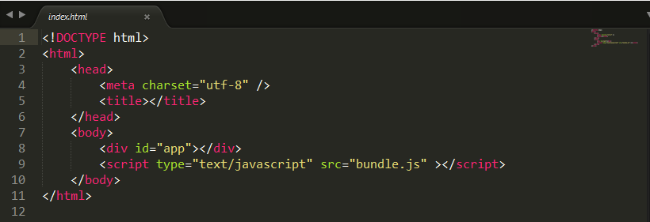
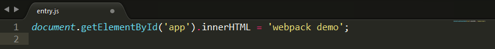
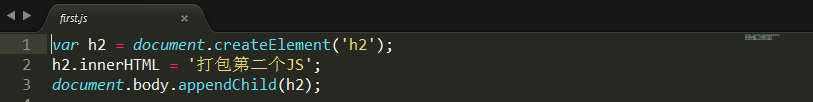
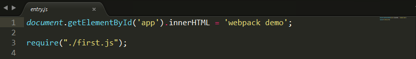

初始化项目环境：
#### 1.首先安装nodejs，如果速度过慢可使用cnpm和nrm来切换npm源地址
#### 2.打开node.js，全局安装webpack，
npm install webpack -g
安装成功后可以输入webpack -h来查看版本信息和指令
#### 3.进入项目文件夹，初始化
npm init
会要求填写一些基础信息，一路回车就行
#### 4.在项目内安装webpack依赖
npm install webpack --save-dev
可以缩写成
npm i webpack -D

#### 使用webpack
在项目根目录下，创建一个index.html，entry.js

文件创建成功后，就可以使用webpack打包了，在命令行界面输入
webpack entry.js bundle.js
然后打开index.html，就可以看到我们在entry.js里面写的webpack demo了
说明entry.js里面的内容已经被打包到bundle.js里面了
如果不同的JS文件之前存在依赖呢？可以使用require引入
再新建一个first.js文件，

然后在entry.js里面require新的first.js文件

重新打包，index.html页面的文件已经更新了
