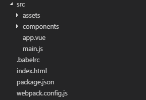

学习webpack和vue的过程中，搭建了一个简单的前端开发脚手架，分享一下开发经验。

#### 1、安装nodejs v5.0+到本地。
#### 2、全局安装webpack。
```
cnpm i -g webpack
```
建议配置淘宝镜像，安装速度比直接npm快很多
```
$ npm install -g cnpm --registry=https://registry.npm.taobao.org
```
#### 3、在工作目录建立脚手架目录，进入目录，然后使用npm命令初始化项目。
```
mkdir webpack-vue-tool
cd webpack-vue-tool
npm init -y
```
-y命令可以一路跳过基本信息设置
#### 4、使用命令行配置目录，建立基础配置文件。
```
mkdir src
//babel配置文件
cd.>.babelrc
//页面入口
cd.>index.html
//webpack配置文件
cd.>webpack.config.js
//进入src目录
cd src
//静态资源，包括图片，第三方js，css等
mkdir assets
//vue组件
mkdir components
//主页组件
cd.>app.vue
//入口js
cd.>main.js
```
至此，目录应该是这个样子的


#### 5、首先来配置package.json文件。
在scripts里删掉默认的test，加上dev开发配置和build打包配置
```
"dev": "webpack-dev-server --hot --inline --progress --color --port 8000",
"build": "webpack --progress --hide-modules"
```
然后安装需要用到的npm包
转化ES6的语法：babel-core,babel-loader,babel-preset-es2015
处理css：css-loader,file-loader,autoprefixer
HTML模版引擎：jade
css预处理语言sass：node-sass,sass-loader,style-loader
处理vue：vue,vue-loader,vue-template-compiler
项目中安装webpack可以控制版本，webpack-dev-server做开发时候的页面预览服务器：webpack,webpack-dev-server
将以下内容添加到package.json里面
```
"devDependencies": {
    "autoprefixer-loader": "^3.2.0",
    "babel-core": "^6.24.1",
    "babel-loader": "^6.4.1",
    "babel-preset-es2015": "^6.24.1",
    "css-loader": "^0.28.0",
    "file-loader": "^0.11.1",
    "jade": "^1.11.0",
    "node-sass": "^4.5.2",
    "sass-loader": "^6.0.3",
    "style-loader": "^0.16.1",
    "vue": "^2.2.6",
    "vue-loader": "^11.3.4",
    "vue-template-compiler": "^2.2.6",
    "webpack": "^2.4.1",
    "webpack-dev-server": "^2.4.2"
}
```
然后安装
```
cnpm i
```
#### 6、然后来配置webpack.config.js。
```
//path对象，webpack对象
var path = require('path')
    webpack = require('webpack');

module.exports = {
  //入口文件
  entry: './src/main.js',
  //输入配置
  output: {
    //输出到项目根目录下的dist文件夹
    path: path.resolve(__dirname, './dist'),
    //公用配置路径
    publicPath: 'dist/',
    //文件名为入口文件名
    filename: '[name].js'
  },
  module: {
    //loaders用来转换文件
    loaders: [
      //转换vue文件
      {
        test: /\.vue$/, 
        loader: 'vue-loader',
        //处理.vue单文件组件里面的sass
        options: {
          loaders: {
            'scss': 'vue-style-loader!css-loader!sass-loader',
            'sass': 'vue-style-loader!css-loader!sass-loader?indentedSyntax'
          }
        }
      },
      //使用babel处理js
      {
        test: /\.js$/,
        loader: 'babel-loader',
        exclude: /node_modules/
      },
      //使用autoprefixer处理css兼容
      { 
        test: /\.css$/,
        loader: 'style-loader!css-loader!autoprefixer-loader?browsers=last 2 version'
      },
      //处理图片并加上hash防止缓存
      {
        test: /\.(png|jpg|gif|svg)$/,
        loader: 'file-loader',
        options: {
          name: '[name].[ext]?[hash]'
        }
      }
    ]
  },
  //插件配置
  plugins: [
    //webpack热替换
    new webpack.HotModuleReplacementPlugin()
  ],
  //开发服务器配置
  devServer: {
    historyApiFallback: true,
    noInfo: false,
    hot: true,
    inline: true,
    port: 8000
  },
  //加快webpack编译速度
  performance: {
    hints: false
  },
  //追踪错误信息
  devtool: '#eval-source-map'
}
```
#### 7、然后是index.html，引入入口js。
```
<html>
    <head>
        <meta charset="utf-8">
    </head>
    <body>
        <div id="app"></div>
        <script src="dist/main.js"></script>
    </body>
</html>
```
#### 8、babel配置写到.babelrc文件里面，便于维护。
```
//预编译es6语法的配置
{
  "presets": [
    ["es2015", { "modules": false }]
  ]
}
```
#### 9、配置入口main.js文件。
```
//引入vue
import Vue from "vue";
//引入页面vue
import App from "./app.vue";
//vue实例                       
new Vue({
    el:'#app',
    render: h => h(App)
});
```
#### 10、在components文件夹里面写几个简单的组件文件。
second.vue
```
<script>
    export default {
        name:"app",
        data () {
            return {
                msg: 'Second Component'
            }
        },
    }
</script>
<template lang="jade">
    div
        span(v-html="msg")
</template>
<style lang="scss" scoped>
    div{
        height:100px;
        width: 50%;
        border: solid 1px;
        margin-top: 10px;
    }
</style>
```
third.vue，里面写了简单的方法，并引入了一张示例图片
```
<script>
    export default {
        data () {
            return {
                msg: 'third Component '
            }
        },
        methods: {
            aaa: () => {
                console.log('666')
            }
        }
    }
</script>
<template lang="jade">
    div
        span(v-text="msg", @click="aaa()")
        img(src="../assets/doge.jpg")
</template>
<style lang="scss" scoped>
    div{
        height:100px;
        width: 50%;
        border: solid 1px;
        margin-top: 10px;
    }
</style>
```
fourth.vue，配置了父组件调用子组件时，给子组件传值，用props接受父组件传过来的值
```
<script>
    export default {
        props: ['msg']
    }
</script>
<template>
    <div>
        <span v-html="msg"></span>
    </div>
</template>
<style lang="scss" scoped>
    div{
        height:100px;
        width: 50%;
        border: solid 1px;
        margin-top: 10px;
    }
</style>
```
script里配置好vue实例、需要用到的data以及页面方法
template里使用了jade模版引擎，使用缩进来表示html的嵌套，[jade教程](https://segmentfault.com/a/1190000000357534)
style里使用了sass预编译css，标签里面加上scoped表示里面的样式只应用于该组件，[sass教程](http://www.w3cplus.com/sassguide/)
#### 11、配置页面app.vue文件。
```
<script>
    import second from './components/second.vue';
    import third from './components/third.vue';
    import fourth from './components/fourth.vue';
    
    export default {
        data () {
            return {
                msg: 'first Component '
            }
        },
        components:{
            second,
            third,
            fourth
        }
    }
</script>
<template lang="jade">
    div
        .first
            span df
            span(v-html='msg')
        second
        third
        fourth(:msg='父组件传值')
</template>
<style lang="scss" scoped>
    .first{
        height:100px;
        width: 50%;
        border: solid 1px;
    }
</style>
```
将页面用一个个组件的方式组装起来，不太明白vue组件写法的可以移步[vue单文件组件](https://cn.vuejs.org/v2/guide/single-file-components.html)
script里面引入各个组件
#### 12、至此，大概脚手架配置文件已经弄好了。
在命令行输入npm run dev命令，然后在页面输入localhost:8000，就可以看到页面效果了